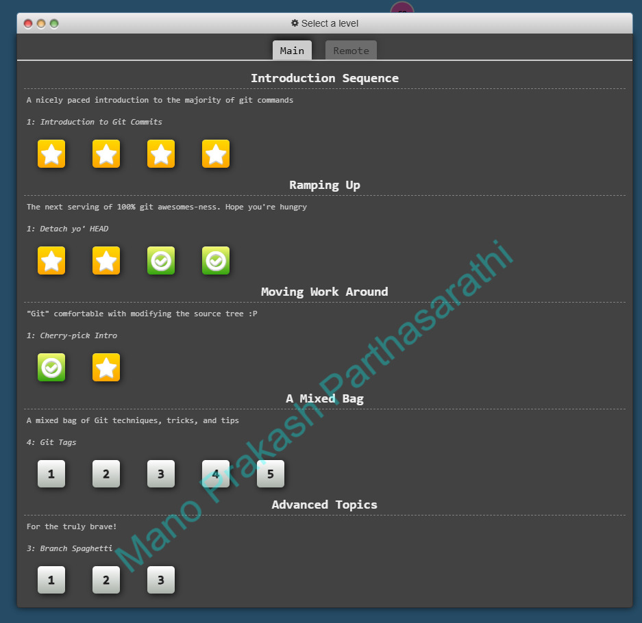
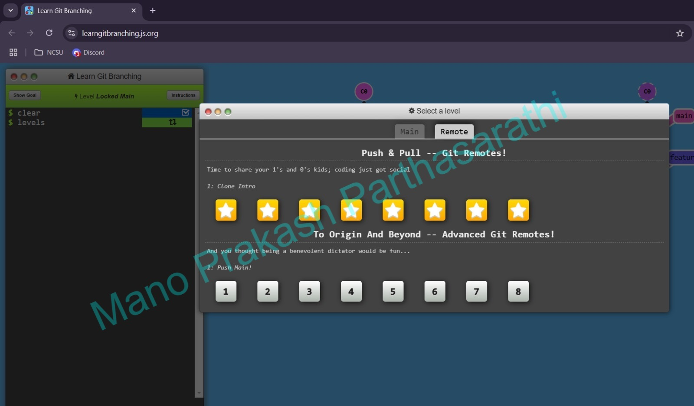

Group 14 CSC510 HW2
[](https://github.com/username/repository/blob/main/LICENSE)
[](https://git-scm.com/)
[](https://github.com/username/repository/issues)
[](https://www.markdownguide.org/)

## Headers
```md
 📝 Introduction
```

##  Image


Screenshot - 01


Screenshot - 02





## Code Example


```sh
# Stage all changes for commit
git add .


# Commit the staged changes with a message
git commit -m "Add changes"


# Push to the remote repository
git push origin YOUR_BRANCH
```


## Task List


## ✅ Task List  


- [x] Task 1: Complete Git Tutorial 
- [x] Task 2: Add Screenshots to `README.md`  
- [x] Task 3: Modify `.html` File  
- [ ] Task 4: Merge latest changes  
- [ ] Task 5: Review pull requests 


```sh
##Example
- [ ] Task 1
- [x] Task 2
```
